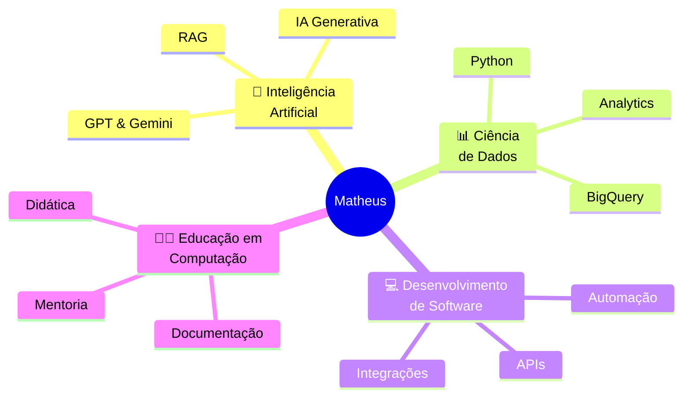
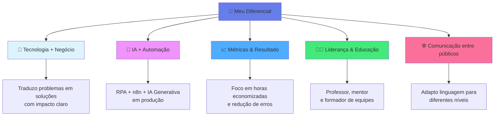
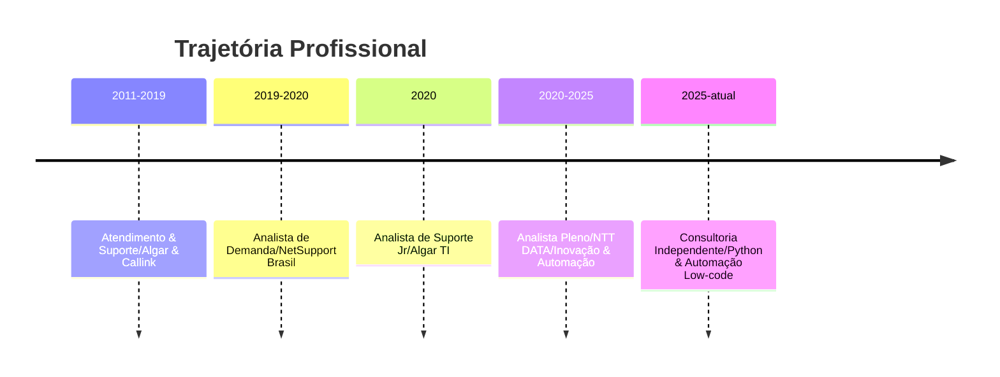
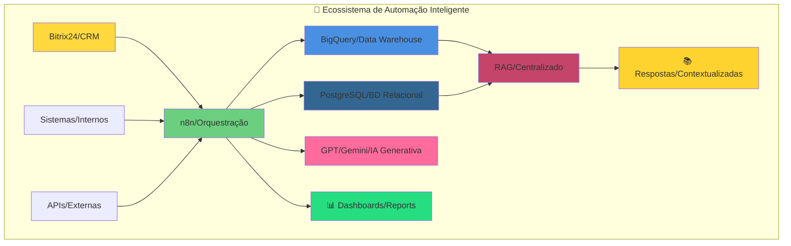
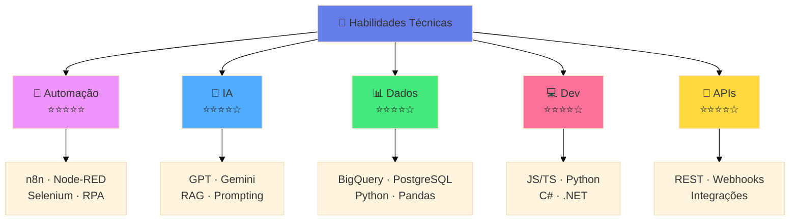
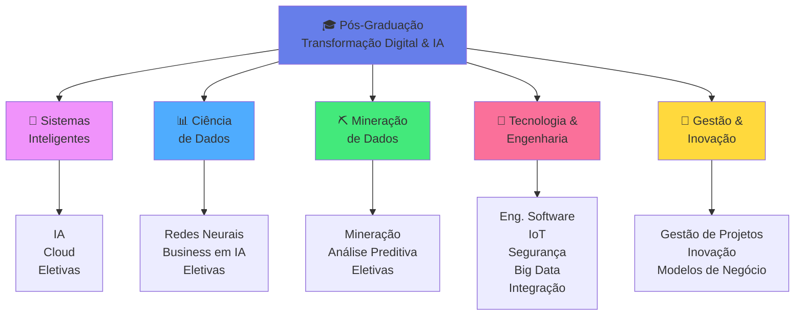
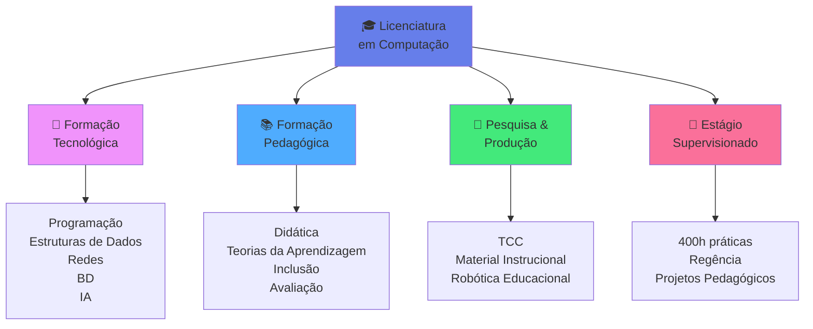

# 👋 Olá! Sou Matheus Souto Leal

📍 **Uberlândia – MG · Remoto / Híbrido · Disponível para Brasil, LATAM e Europa**

**Desenvolvedor de Automação Inteligente e IA · Pós-graduação em Ciência de Dados · Professor de Computação**  
**Experiência global em Inovação e Hiperautomação**

## 🧭 Navegação Rápida
### 📍 Encontre o que você procura

> **💡 Dica:** Clique nas badges abaixo para ir direto à seção desejada

<b>🎯 Áreas Principais</b>

 

| Seção | Resumo | Acesso |
|:------|:-------|:------:|
| **👤 Quem Sou** | Perfil profissional · Missão · 5+ anos de experiência |  |
| **🧬 Diferencial** | Tecnologia + Negócio · IA + Automação · Métricas |  |
| **💼 Experiência** | NTT DATA · Consultoria · Projetos globais |  |
| **🏆 Projetos** | Ambev (-21h/mês) · BrasilSeg (-70%) · TIM (-80%) |  |
| **🛠️ Stack** | n8n · Python · BigQuery · GPT/Gemini · RAG |  |
| **🎓 Formação** | Pós em IA · Licenciatura · Professor |  |
| **🧠 Soft Skills** | Colaboração · Mentoria · Liderança técnica |  |
| **📞 Contato** | LinkedIn · Email · WhatsApp · Portfólio |  |

<b>🔥 Atalhos para Recrutadores</b>

 

- **📊 Experiência:** 5+ anos em Automação Inteligente, IA e Inovação → [Ver detalhes](#-experiência-profissional)
- **💡 Projetos destaque:** Reduções de 60-90% em esforço manual → [Ver cases](#-projetos-de-automação-relevantes)
- **🛠️ Stack principal:** RPA, n8n, Node-RED, Python, BigQuery, GPT/Gemini → [Ver stack completa](#%EF%B8%8F-habilidades-técnicas-hard-skills)
- **💬 Contato direto:** → [Falar comigo agora](#-vamos-conversar)

## 🧾 Resumo 
> Auxilio empresas a **reduzir de 60 a 90% do esforço manual** e **aumentar a qualidade de dados e decisões** por meio de **Automação Inteligente, IA aplicada e Análise de Dados**, atuando desde a descoberta do problema até a operação escalável da solução.

- 🔧 **Stack principal:** RPA, n8n, Node-RED, Python, BigQuery, PostgreSQL, Selenium, GPT/Gemini/RAG  
- 🌍 **Atuação:** Projetos com clientes na Europa e América Latina  
- 🎓 **Base sólida em educação:** Professor de Computação, com experiência em mentoria, treinamento e documentação técnica  

| Área | O que entrego |
|------|-------------------|
| 🚀 **Automação Inteligente & Hiperautomação** | RPA + n8n + Node-RED + IA (GPT/Gemini/RAG) para **reduzir de 60 a 90% o esforço manual**, diminuir erros e aumentar a confiabilidade operacional. |
| 🧠 **IA & Dados aplicados ao negócio** | Python, BigQuery, PostgreSQL e BI para **produtos analíticos**, dashboards e decisões orientadas a dados. |
| 📚 **Educação, Mentoria & Liderança Técnica** | Professor de Computação com experiência em **formar equipes**, preparar materiais, documentar e traduzir conceitos complexos para diferentes públicos. |

🎯 **O que estou buscando agora**
| Tipo | Oportunidades |
|------|---------------|
| 👔 **Full-time (Pleno/Sênior/Consultor)** | Automação Inteligente (RPA, n8n, Node-RED), IA aplicada a processos, Engenharia/Plataformas de Integração. |
| 🧠 **Consultoria / Freelancer** | Descoberta e priorização de processos, MVPs de **IA + dados + automação**, modernização de pipelines existentes. |
| 🚀 **Parcerias em Produtos (SaaS / DevTools)** | Soluções de produtividade, gestão operacional, ferramentas para desenvolvedores e equipes de engenharia (observabilidade, automação, IA). |

Se você é **recrutador, líder técnico ou fundador** e precisa de alguém para **implementar automações inteligentes, plataformas de IA ou integrações complexas**, meu contato está no final deste perfil.

---

**Navegação rápida:** 
[Perfil](#-quem-sou) · 
[Diferencial](#-meu-diferencial) · 
[Experiência](#-experiência-profissional) · 
[Projetos](#-projetos-de-automação-relevantes) · 
[Stack](#%EF%B8%8F-habilidades-técnicas-hard-skills) · 
[Formação](#-formação-acadêmica) · 
[Contato](#-vamos-conversar)

## 👤 Quem Sou

Sou um profissional de tecnologia com **5+ anos de experiência** focado em **Automação Inteligente, IA e Inovação**, atuando na intersecção entre:

> **Missão:** Conectar desafios de negócio a soluções tecnológicas com **impacto mensurável**, mantendo sempre o foco em **desenvolvimento humano, acessibilidade da informação e geração de valor**.

Minha trajetória é fundamentada na **Licenciatura em Computação (IFTM)**, que moldou a visão de tecnologia como **ferramenta de capacitação e alfabetização digital**, e na **Pós-graduação em Transformação Digital e Inteligência Artificial (UNINTER)**, que reforça a aplicação de **IA, Ciência de Dados e Arquiteturas Modernas** em contextos reais de negócio.

### 🧩 Três Papéis Complementares

| Papel | Foco |
|------|------|
| 👨‍💻 **Técnico** | Construção de soluções robustas de **automação e IA** em todo o ciclo de vida (descoberta → entrega → operação). |
| 🎯 **Estrategista** | Uso de **Dados e IA** para apoiar **decisão, priorização e vantagem competitiva**, com visão de produto. |
| 📚 **Educador** | **Professor e mentor**, com habilidade de **traduzir temas complexos** e gerar documentação e treinamentos escaláveis. |

---

## 🧬 Meu Diferencial

| Dimensão | Descrição |
|----------|-----------|
| 🧩 **Tecnologia + Negócio** | Traduzo problemas reais de operação em **automações e produtos de IA com impacto claro** em tempo, custo e qualidade. |
| 🤖 **IA + Automação** | Experiência prática combinando **RPA, n8n/Node-RED, BigQuery, bancos relacionais e GPT/Gemini/RAG** em ambientes de produção. |
| 📈 **Métricas & Resultado** | Foco em **indicadores concretos**: horas economizadas, percentual de redução de erros, aumento de precisão e throughput. |
| 🧑‍🏫 **Liderança & Educação** | Professor de Computação, experiente em **mentorar, documentar e formar equipes** em contextos globais (Europa e LATAM). |
| 🌐 **Comunicação entre públicos** | Capacidade de **adaptar linguagem e profundidade técnica** para desenvolvedores, especialistas, gestores, iniciantes e pessoas em transição para tecnologia – garantindo alinhamento e engajamento. |

---

## 💼 Experiência Profissional

<strong>🟨 Consultoria Independente – Desenvolvedor Python Pleno · Automação Low-code / No-code</strong>

#### 🏹 Principais Conquistas & Responsabilidades

- **Desafio:**  
  Integrar múltiplos sistemas heterogêneos (CRM, ERP, ferramentas internas, bases de dados) de forma escalável, com visibilidade e inteligência sobre os fluxos de automação.

- **Solução (Arquitetura):**

- **Resultados (Métricas de Impacto):**
  - ✅ **Documentação 100% automatizada** de todos os fluxos no n8n  
  - ✅ **RAG centralizado** com respostas contextualizadas e atualizadas  
  - ✅ **Redução significativa no esforço de manutenção**, com automações mais fáceis de entender, auditar e evoluir  
  - ✅ **15+ sistemas integrados** em um único ecossistema orquestrado
  - ✅ **1.000+ interações/dia** processadas com IA generativa

<strong>🟦 Analista Pleno em Desenvolvimento de Software · Inovação e Automação — NTT DATA</strong>

**Período:** Ago/2020 – Jun/2025 (4 anos e 11 meses)  
🌍 Clientes na **Europa e América Latina**

Atuação na equipe de **Inovação e Automação**, desenvolvendo soluções de alto impacto em hiperautomação.

#### 🏹 Destaques

- 🤖 **RPA e Automações de Alto Impacto**
  - Robôs para processos críticos (seguros, telecom, indústria, bancos).
  - Resultados típicos:
    - ⏱ **Até 80% de redução** no esforço manual
    - 🎯 **Até 95% de aumento** na precisão de dados

- 🧭 **Liderança Técnica de Projetos**
  - Ciclo completo: descoberta, desenho de solução, desenvolvimento, testes, implantação e evolução contínua.
  - Atuação com **stakeholders de negócio e TI** (Europa & LATAM).

- 🤝 **Colaboração & Formação de Equipes**
  - Equipes **multidisciplinares e globais**.
  - Onboarding acelerado e mentoria técnica.
  - Produção de **documentação técnica** e materiais de treinamento.

- 🚀 **Proatividade Tecnológica**
  - Introdução de:
    - **Node-RED**
    - Integração com **Azure DevOps**
    - **Data Lake** e **MongoDB**
    - Arquiteturas mais **observáveis e escaláveis**

- 🧰 **Stack-chave na NTT DATA**
  - **JavaScript**, **.NET/C#**, **Python**
  - **Selenium**, **RPA**, **APIs REST**, **Webhooks**
  - Integração com JIRA, Power BI e outros sistemas de gestão

<strong>🟩 Trajetória Anterior — Suporte, Processos e Operação</strong>

- **Analista de Suporte Jr · Algar TI Consultoria S.A.** *(Jan/2020 – Ago/2020)*  
  Gestão de ordens de serviço e tratamento de chamados em tecnologia **VOBB (voz e dados)**.

- **Analista de Demanda · NetSupport Brasil** *(Ago/2019 – Jan/2020)*  
  Gestão de demandas e recursos técnicos de campo, acompanhamento de ponta a ponta.

- **Atendimento & Suporte Técnico · Algar & Callink** *(Set/2011 – Jul/2019)*  
  De Jovem Aprendiz a Assistente de Suporte Operacional e backup de Líder Técnico.  
  Base sólida em:
  - 🧩 Entendimento de processos  
  - 🎧 Suporte ao cliente  
  - 🛠 Resolução de problemas na prática  

---

## 🏆 Projetos de Automação Relevantes

Para facilitar a leitura, organizei em **cards resumidos** e uma **tabela comparativa**.

### 📌 Cards de Impacto

| Cliente / Projeto | Impacto Principal |
|-------------------|-------------------|
| 🛡️ **Ambev – Extração VMV/SAP** | 💡 **+21 horas/mês economizadas** com robô que extrai, consolida e envia relatórios automaticamente. |
| 📊 **Mapfre – Indicadores (ETL + BI)** | 🔍 Base histórica estruturada para BI, permitindo **indicadores consolidados de qualidade de testes**. |
| 🧾 **Ambev – Acta (Verificação de Jobs)** | ✅ Monitoramento automatizado com e-mail de status, **reduzindo esforço manual e risco de falhas não detectadas**. |
| 🛟 **BrasilSeg – Automação de Seguros** | ⏱ **-70% no tempo**, 🎯 **+95% na precisão**, 🔁 **-90% no retrabalho** em processos de seguros. |
| 📡 **TIM – Automação SAP** | ⏱ **-80% no tempo operacional** e eliminação de erros manuais em atividades SAP. |
| 🧠 **Blips – Automação Inteligente com IA** | 🤖 **15+ sistemas integrados**, **1.000+ interações/dia com IA** + **RAG centralizado**. |

---

### 📊 Visão Detalhada em Tabela

<strong>Ver tabela completa de projetos</strong>

| Projeto | Desafio | Solução | Stack / Conceito | Impacto / Resultado |
|--------|---------|---------|------------------|----------------------|
| **Ambev – Extração VMV/SAP** | Extração manual e recorrente de relatórios VMV + SAP, consumindo tempo e sujeita a erros. | Robô que faz login automático, extrai relatórios, compara dados, consolida em Excel e dispara por e-mail. | `Selenium` · `Python` · `ETL` | ⏱ **+21 horas/mês economizadas** · 🎯 **Redução de erros** |
| **Mapfre – Indicadores (ETL + BI)** | Necessidade de gerar indicadores de testes com histórico a partir do **HP ALM**. | Robô de **ETL** que extrai do ALM, transforma e carrega em **PostgreSQL**, criando base para BI. | `HP ALM` · `PostgreSQL` · `ETL` | 🔍 Base histórica estruturada para BI e dashboards |
| **Ambev – Acta (Verificação de Jobs)** | Verificação manual de Jobs 4x/dia, com risco de falhas passarem despercebidas. | Robô que acessa o sistema, verifica Jobs/falhas e envia e-mail com status. | `Selenium` · `Python` · `Agendamento` | ✅ Monitoramento automatizado · 🔁 **Redução de risco** |
| **BrasilSeg – Automação de Seguros** | Processos de seguros manuais, lentos e com retrabalho. | Automação de processos-chave de seguros. | RPA · Integrações · ETL | ⏱ **-70% no tempo** · 🎯 **+95% na precisão** · 🔁 **-90% no retrabalho** |
| **Ambev – Sistema de Monitoramento** | Monitoramento pouco responsivo de incidentes. | Painel em C#/.NET com monitoramento em tempo real. | `.NET/C#` · Monitoramento | ⏱ **-60% no tempo de resposta** a incidentes |
| **Bradesco – Gestão de Recursos** | Falta de visibilidade da capacidade e alocação. | Integração **JIRA + Power BI** para visão de capacidade, alocação e gargalos. | JIRA · Power BI | Melhoria na gestão de alocação e identificação de gargalos |
| **TIM – Automação SAP** | Tarefas SAP manuais, com alto esforço e risco de erro. | RPA com **SapGUIAutomation + VBScript**. | `SapGUIAutomation` · `VBScript` · RPA | ⏱ **-80% no tempo operacional** · ✅ **Eliminação de erros** |
| **Blips – Automação Inteligente com IA** | Necessidade de integrar múltiplos sistemas e centralizar inteligência. | Ecossistema com **15+ sistemas integrados** e **RAG centralizado**, permitindo respostas contextualizadas com IA Generativa. | `n8n` · `BigQuery` · `PostgreSQL` · `GPT/Gemini` · `RAG` | 🤖 **15+ sistemas** · 🧠 **1.000+ interações/dia com IA** · 📚 **Documentação 100% automatizada** |
| **EES – Automação de Testes** | Execução manual de testes, sem padronização e sem CI/CD. | Framework de testes com **Selenium + .NET/C#**, integrado ao pipeline. | `Selenium` · `.NET/C#` · CI/CD | ✅ Padronização de testes · 🚀 Integração contínua |

👉 Mais detalhes e outros casos no meu [portfólio](https://msoutole.github.io/knowledge).

---

## 🛠️ Habilidades Técnicas (Hard Skills)

### 🎯 Stack por Categoria

<strong>🤖 Automação & Orquestração</strong>

**Nível:** ⭐⭐⭐⭐⭐ Especialista

<strong>🧠 Inteligência Artificial</strong>

**Conceitos:** RAG · IA Generativa · Prompting · Fine-tuning  
**Nível:** ⭐⭐⭐⭐☆ Avançado

<strong>📊 Dados & Analytics</strong>

**Nível:** ⭐⭐⭐⭐☆ Avançado

<strong>💻 Desenvolvimento</strong>

**Nível:** ⭐⭐⭐⭐☆ Avançado

<strong>🔗 Integrações & APIs</strong>

**Nível:** ⭐⭐⭐⭐☆ Avançado

<strong>🛠️ DevOps & Tools</strong>

**Nível:** ⭐⭐⭐⭐☆ Avançado

---

### 📊 Visão por Domínio

| Domínio | Plataformas / Ferramentas | Linguagens / Tecnologias | Nível |
| :------ | :------------------------ | :------------------------ | :---- |
| **Inteligência Artificial (IA)** | Integração com **GPT, Gemini**, **RAG**, IA Generativa | Python, APIs, cURL | ⭐⭐⭐⭐☆ |
| **Automação de Processos (RPA)** | **n8n**, **Node-RED**, Selenium, SapGUIAutomation | C#, VBScript, JavaScript | ⭐⭐⭐⭐⭐ |
| **Ciência de Dados** | **BigQuery**, ferramentas de BI | Python (Pandas, Matplotlib, Seaborn) | ⭐⭐⭐⭐☆ |
| **Integrações & APIs** | Webhooks, REST APIs, Bitrix24, Confluence | Node.js, JS/TS, SQL | ⭐⭐⭐⭐☆ |
| **Dev & DevTools** | GitHub, CI/CD, ETL, testes | Boas práticas, versionamento, automação | ⭐⭐⭐⭐☆ |

> ⭐⭐⭐⭐⭐ Especialista · ⭐⭐⭐⭐☆ Avançado · ⭐⭐⭐☆☆ Intermediário

### 🔍 Palavras-chave (para quem tem pouco tempo)

`RPA` · `n8n` · `Node-RED` · `Python` · `BigQuery` · `PostgreSQL` · `Selenium` · `GPT` · `Gemini` · `RAG` ·  
`ETL` · `APIs REST` · `Integrações` · `Hiperautomação` · `Automation Engineer` · `Data-Driven Automation`

---

## 🧠 Competências Comportamentais & Liderança

**Fortalezas principais:**

- 🤝 **Trabalho em equipe & colaboração** – Experiência consolidada em equipes globais e multidisciplinares  
- 🚀 **Proatividade & iniciativa** – Antecipo oportunidades e proponho melhorias técnicas e de processo  
- ⚡ **Aprendizado rápido** – Absorvo rapidamente novos domínios de negócio e ferramentas  
- ❤️ **Relacionamento interpessoal** – Construo relações de confiança com pares, líderes e clientes  
- 📌 **Compromisso & responsabilidade** – Foco em **entregar** com qualidade e impacto  
- 📚 **Mentoria & didática** – Explico conceitos complexos de forma acessível e estruturada para diferentes níveis

**Foco atual de desenvolvimento contínuo:**

1. 🎯 **Acurácia em planejamento e estimativas**  
2. 📋 **Gestão de prioridades e foco**  
3. 🗣️ **Comunicação ainda mais objetiva + escuta ativa**  
4. 🧩 **Pensamento analítico e conceitual em nível estratégico**

---

## 🎓 Formação Acadêmica

### 🎓 Pós-Graduação – Transformação Digital e Inteligência Artificial  
**UNINTER Centro Universitário Internacional** · *Abr/2025 – Presente*  

<strong>Ver detalhes da pós-graduação</strong>

Pós-graduação estruturada em três grandes eixos técnicos — **Sistemas Inteligentes**, **Ciência de Dados** e **Mineração de Dados** — apoiados por uma base sólida de **Engenharia de Software, Arquitetura de Sistemas, Cloud, IoT, Segurança e Gestão**.

Na prática, isso reforça minha atuação em:

- Projetar e aplicar **modelos de IA e Redes Neurais** em cenários reais de negócio  
- Trabalhar com **Mineração de Dados e Análise Preditiva** para apoiar decisões e automações orientadas a dados  
- Entender e utilizar **Big Data, Cloud e Integração de Sistemas Legados** em arquiteturas modernas  
- Conectar **Tecnologia + Estratégia + Negócio** por meio de disciplinas de gestão, inovação e modelos de negócio  
- Dominar conceitos modernos como **IoT, 5G, Segurança, Computação em Nuvem** e **Gestão de Projetos**

---

<strong>🧠 Sistemas Inteligentes</strong>

Trilha focada em **IA aplicada**, computação em nuvem e fundamentos para construção de sistemas inteligentes e escaláveis.

**Disciplinas:**

- **Inteligência Artificial**  
  - Fundamentos de IA, agentes inteligentes, busca e heurísticas  
  - Base conceitual que se conecta com RPA, automação inteligente e IA generativa  

- **Computação em Nuvem**  
  - Conceitos de Cloud (IaaS, PaaS, SaaS)  
  - Arquiteturas distribuídas, escalabilidade e disponibilidade  
  - Fundamento para soluções de automação e IA em nuvem  

- **Eletiva I**  
- **Eletiva II**  

<strong>📊 Tecnologia de Ciência de Dados</strong>

Foco em **modelagem de IA**, **Redes Neurais** e visão de negócio aplicada à IA.

**Disciplinas:**

- **Redes Neurais Artificiais**  
  - Perceptron, MLP, funções de ativação  
  - Treinamento de modelos, overfitting/underfitting, regularização  

- **Business em Inteligência Artificial**  
  - Conexão entre IA e objetivos de negócio  
  - Casos de uso, visão de ROI, governança de IA  
  - Auxilia a posicionar IA como alavanca estratégica, não apenas técnica  

- **Eletiva V**  
- **Eletiva VI**  

<strong>⛏️ Tecnologia de Mineração de Dados</strong>

Trilha voltada para **descoberta de padrões**, insights e construção de modelos preditivos.

**Disciplinas:**

- **Mineração de Dados**  
  - Técnicas de agrupamento, classificação, regras de associação, detecção de outliers  
  - Alinhado à identificação de oportunidades de automação e melhoria de processos  

- **Análise Preditiva**  
  - Modelos para previsão (demanda, risco, churn, etc.)  
  - Suporte à tomada de decisão baseada em dados e previsões  

- **Eletiva III**  
- **Eletiva IV**  

<strong>🧩 Eixo de Tecnologia e Engenharia</strong>

Base técnica que sustenta as soluções de automação, IA e dados.

**Disciplinas:**

- **Engenharia de Software**  
  - Ciclo de vida, requisitos, arquitetura, testes, manutenção  
  - Estrutura para projetos robustos de automação e IA  

- **Internet das Coisas (IoT)**  
  - Dispositivos conectados, sensores, atuadores  
  - Automações que integram mundo físico e digital  

- **Segurança da Informação**  
  - Confidencialidade, integridade, disponibilidade  
  - Essencial em automações que lidam com dados sensíveis e sistemas críticos  

- **Big Data**  
  - Volume, variedade, velocidade, veracidade  
  - Arquiteturas e ferramentas para dados massivos, alinhado com BigQuery e Data Lakes  

- **Probabilidade e Métodos Quali-Quantitativos para Tomada de Decisões**  
  - Probabilidade, estatística aplicada, métodos qualitativos e quantitativos  
  - Suporte analítico para interpretar métricas e resultados de automação/IA  

- **Redes Sem Fio**  
  - Protocolos, topologias, mobilidade  
  - Conecta com soluções de IoT e cenários distribuídos  

- **Integração de Sistemas Legados**  
  - Estratégias para integrar sistemas antigos com soluções modernas  
  - Relevante para hiperautomação em ambientes corporativos complexos  

- **Modelos de Negócios Inovadores**  
  - Estruturação de modelos de negócio, proposta de valor, canais, receita  
  - Visão para **produtos próprios (SaaS/devtools)**  

<strong>🎯 Gestão, Inovação e Negócios</strong>

Trilha orientada a **gestão de projetos**, **pessoas**, **inovação** e visão de negócio.

**Disciplinas:**

- **Gestão de Projetos**  
  - Metodologias, planejamento, risco, entrega  
  - Base prática para liderar projetos de automação e IA ponta a ponta  

- **Gestão por Competências**  
  - Mapeamento de competências, desenvolvimento de pessoas  
  - Apoia atuação como mentor e líder técnico  

- **Elaboração e Implantação de Projetos**  
  - Da concepção à implantação  
  - Conecta com a experiência em implementar automações do papel até a produção  

- **Gestão Estratégica da Inovação**  
  - Processos e frameworks para inovar continuamente  
  - Alinhado com equipes de inovação, labs e áreas de hiperautomação  

- **Análise de Custos**  
  - Cálculo e avaliação financeira de projetos  
  - Reforça a capacidade de construir **business cases** para automação/IA  

- **Da Ideia ao Plano de Negócios**  
  - Estruturação de produtos e serviços, validação e planejamento  
  - Alinhado com a visão de criar **SaaS e devtools**  

- **Tecnologia 5G**  
  - Conceitos, aplicações e impacto em conectividade  
  - Amplia o horizonte para pensar em soluções distribuídas e em tempo real  

---

### 🧑‍🏫 Licenciatura em Computação  
**Instituto Federal do Triângulo Mineiro (IFTM) – Campus Uberlândia Centro** · *Ago/2016 – Ago/2023*

<strong>Ver detalhes da licenciatura</strong>

Curso estruturado para formar **professores de Computação** com visão tecnológica para atuar na **educação básica**, no **ensino profissional técnico de nível médio** e em **ambientes não formais de ensino**.

A matriz curricular integra **formação específica em Computação**, **fundamentos pedagógicos**, **prática docente** e **estágio supervisionado**, sempre com foco em **transposição didática** e **alfabetização digital**.

Na prática, isso reforça minha atuação em:

- Ensinar **lógica, programação e fundamentos de computação** para diferentes níveis
- Planejar, implementar e avaliar **projetos pedagógicos com tecnologia**
- Traduzir conteúdos complexos de computação em **experiências de aprendizagem acessíveis**
- Atuar tanto em **sala de aula** quanto em **projetos de inovação educacional** e **formação de professores**

---

<strong>🧠 Núcleo de Formação Específica e Tecnológica em Computação</strong>

Focado em **fundamentos de Computação, engenharia de software e tecnologias** que embasam tanto o desenvolvimento quanto o ensino na área.

**Destaques de disciplinas:**

- **Fundamentos da Programação e Lógica**  
  - Lógica de Programação  
  - Algoritmos e Programação (modularização, recursividade, strings, complexidade, busca e ordenação)

- **Estruturas de Dados e Teoria da Computação**  
  - Matemática Discreta (estruturas discretas, raciocínio lógico e prova)  
  - Estruturas de Dados (listas, filas, pilhas, árvores binárias/AVL, grafos)  
  - Linguagens Formais e Autômatos  
  - Teoria da Computação (máquina de Turing, computabilidade, decidibilidade, complexidade)

- **Arquitetura, Sistemas e Redes**  
  - Introdução à Informática (sistemas digitais, lógica booleana, blocos básicos)  
  - Arquitetura e Organização de Computadores (RISC/CISC, pipeline, arquiteturas avançadas)  
  - Sistemas Operacionais (concorrência, gerenciamento de memória, armazenamento)  
  - Redes de Computadores I e II (modelo OSI/TCP-IP, endereçamento IP, VLANs, roteamento, DHCP, NAT, serviços IP)

- **Banco de Dados e Engenharia de Software**  
  - Banco de Dados I (modelagem ER, modelo relacional, normalização, SQL básico)  
  - Banco de Dados II (SQL avançado, otimização, concorrência, fundamentos de NoSQL)  
  - Engenharia de Software (processos tradicionais e ágeis, requisitos, UML)

- **Desenvolvimento de Sistemas e Ambientes Educacionais**  
  - Programação Orientada a Objetos (classes, objetos, encapsulamento, herança, abstração, polimorfismo)  
  - Engenharia de Software Aplicada a Ambientes Educacionais (sistemas com formulários, relatórios, foco em contexto educacional)

- **Áreas Aplicadas de Computação**  
  - Sistemas para Internet (Web 1.0/2.0/3.0, modelo cliente-servidor)  
  - Computação Gráfica (visualização 2D/3D, RV e RA)  
  - Interação Humano-Computador (usabilidade, ergonomia, acessibilidade)  
  - Inteligência Artificial e Computacional (agentes, redes neurais, aprendizado de máquina, computação evolutiva)

<strong>📚 Núcleo de Formação Pedagógica e Prática Docente</strong>

Garante a formação como **educador**, capaz de planejar, conduzir e avaliar processos de ensino-aprendizagem em Computação.

**Destaques de disciplinas:**

- **Fundamentos e Teorias Educacionais**  
  - História da Educação Brasileira  
  - Fundamentos Filosóficos e Sociológicos da Educação  
  - Políticas Educacionais e legislação  
  - Teorias da Aprendizagem I e II (Piaget, Vygotsky, Wallon, Gardner, concepções inatistas, ambientalistas, interacionistas)  
  - Profissão e Formação Docente (constituição histórica do trabalho docente, papel do Estado, saberes da docência)

- **Metodologias e Didática**  
  - Didática (planejamento da prática pedagógica, metodologias de ensino)  
  - Metodologia do Ensino da Computação  
  - Prática de Ensino de Computação (uso de tecnologias digitais, transposição didática, prática da docência)

- **Inclusão e Diversidade**  
  - Direitos Humanos e Diversidade (raça, gênero, sexualidade)  
  - Educação Inclusiva (bases conceituais, legislação, adequação curricular)  
  - Libras (história da educação de surdos, Língua Brasileira de Sinais)

- **Gestão e Currículo**  
  - Escola e Currículo (concepções, organização, planejamento, avaliação curricular)  
  - Gestão Escolar (PPP, gestão democrática, planejamento participativo)

- **Tecnologias Educacionais e Avaliação**  
  - Tecnologia Educacional (informática educativa, mídias digitais, inclusão digital)  
  - Análise de Dados Educacionais (estatística básica aplicada à educação)  
  - Avaliação das Aprendizagens (pressupostos teóricos, modalidades, instrumentos)  
  - Ambientes e Comunidades Virtuais de Aprendizagem (EAD, tutoria, avaliação online)

<strong>🔬 Metodologia, Pesquisa e Produção Didática</strong>

Base para atuar com **pesquisa aplicada em educação e computação** e produção de materiais instrucionais.

**Destaques de disciplinas:**

- **Metodologia e Pesquisa**  
  - Metodologia Científica  
  - Produção de Textos  
  - Projeto de Licenciatura (planejamento do TCC)  
  - Trabalho de Conclusão de Curso I e II (pesquisa teórica/empírica ou desenvolvimento de material didático/tecnologia educacional)

- **Produção Didática e Tecnologias Aplicadas**  
  - Produção de Material Instrucional (objetos digitais de aprendizagem, EAD, integração de mídias)  
  - Robótica Educacional (projetos com raciocínio lógico, programação e construção de maquetes/protótipos)

- **Linguagem Estrangeira**  
  - Inglês para Fins Acadêmicos (leitura de textos técnicos em tecnologia e educação)

<strong>🧪 Estágio Curricular Supervisionado</strong>

Total de **400 horas**, em quatro etapas progressivas, conectando teoria, prática e reflexão crítica.

- **Estágio Curricular I e II**  
  - Observação do cotidiano escolar e dos espaços de ensino de informática  
  - Diagnóstico de contextos, perfis de alunos e condições de infraestrutura  
  - Elaboração de projetos de estágio, articulando teoria e prática

- **Estágio Curricular III e IV**  
  - Regência de aulas e/ou atuação em concepção, planejamento e gestão pedagógica em Computação  
  - Desenvolvimento de práticas inter, multi e transdisciplinares  
  - Reflexão crítica e sistematização das experiências  
  - Atuação em escolas de educação básica, ensino técnico/tecnológico e espaços não formais (ONGs, projetos sociais, empresas)

<strong>📌 Disciplinas Optativas (Tópicos de Aprofundamento)</strong>

Optativas voltadas a **aprofundar** e **atualizar** conhecimentos em Computação e Educação:

1. **Avaliação e Seleção de Recursos Computacionais** – Levantamento, projeto de infraestrutura e orçamento de TI para escolas  
2. **Sistemas Distribuídos** – Fundamentos de computação distribuída, tolerância a falhas, transações, programação para Internet e nuvem  
3. **Fundamentos de Web Design** – HTML, CSS, responsividade, padrões web, introdução a JavaScript  
4. **Implementação e Teste de Sistemas** – Desenvolvimento OO com acesso a BD (CRUD, login, relatórios) e verificação/validação de software  
5. **Projeto de Algoritmos** – Técnicas avançadas (guloso, divisão e conquista, programação dinâmica)  
6. **Aprendizagem Colaborativa Assistida por Computador** – Desenho e avaliação de ambientes de aprendizagem colaborativa online  
7. **Aplicações para Dispositivos Móveis na Educação** – Desenvolvimento de apps educacionais multiplataforma  
8. **Tópicos Especiais em Educação e Computação** – Temas variáveis conforme tendências da área e interesse dos estudantes  

---

## 🤝 Vamos Conversar?

Estou **aberto a**:

- 💼 **Posições Full-time** em Engenharia de Automação/IA/Dados (**Pleno/Sênior/Consultor**)  
- 🧠 **Consultorias** em RPA, IA, dados e orquestração (n8n, Node-RED, integrações complexas)  
- 🎓 **Mentorias, treinamentos e workshops** para equipes de tecnologia e áreas de negócio  
- 🚀 **Parcerias em produtos** (SaaS, automações, devtools)

  

---

**Feito com ❤️ por [Matheus Souto Leal](https://github.com/msoutole)**  
*Transformando desafios em soluções inteligentes, acessíveis e escaláveis.*

